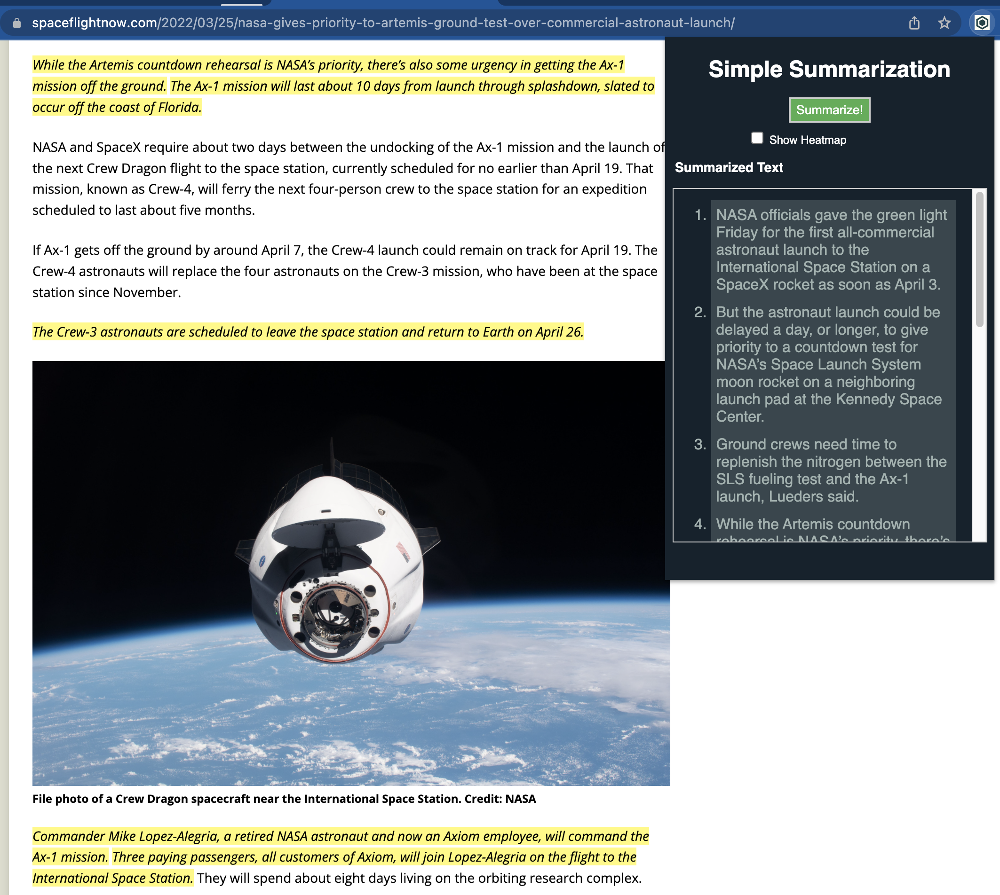

# simple-summarization

Python function to be deployed to an AWS Lambda endpoint that takes a url of an article and returns the summary and metadata that's obtained from the newspaper library.

## Example:
